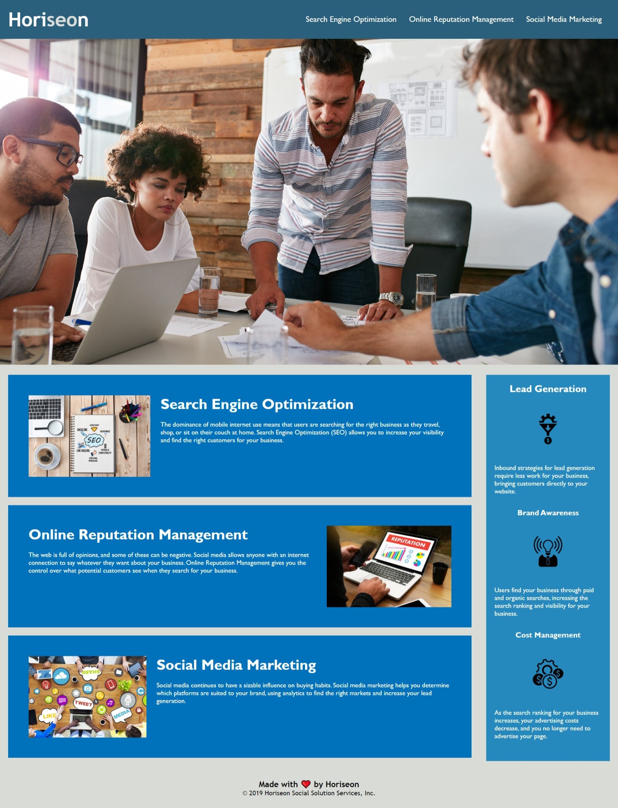

# Refactor Website
​
## �� TABLE OF CONTENT
​
- [Description](#-description)
- [Usage](#-usage)
- [Mock-up](#-mock-up)
- [Technology used](#-technology-used)
- [Installation](#-installation)
- [Credits](#-credits)
- [License](#-license)
​
## �� DESCRIPTION
​
### �� What is it about?
​
This project is about understanding HTML and CSS and correcting issues that are found within the code. This project looks at the accessiblity of the code that is given.
​
## �� USAGE
​
[**>> Visit my portfolio website <<**](https://github.com/khans0/)
​
### �� User story
​
```
AS A marketing agency
I WANT a codebase that follows accessibility standards
SO THAT our own site is optimized for search engines
```
​
​
```
GIVEN the webiste
​
WHEN the site loads it must meet the accessiblity standards
SO the semantic HTML elements can be found throughout the codxe
​
WHEN the image and icon elements are shown 
THEN there are 'alt' attributes to all of them

```
​

​
### ✅ Acceptance Criteria
​
It's done when:
​
- [ ] Semantic HTML elements can be found throughout the source code
- [ ] HTML elements follow a logical structure independent of styling and positioning
- [ ] Image and icon elements contain accessible `alt` attributes
- [ ] Heading attributes fall in sequential order
- [ ] Title elements contain a concise, descriptive title
​
## �� MOCK-UP
​​

​
​
## �� TECHNOLOGY USED
​
- HTML
- CSS
​
### �� What I've learnt
​
Learnt how to add simialr css properties together under one class, learnt about semantic html tags
​
### ➕ Suggestions for improvement
​

​
## �� INSTALLATION
​
N/A
​
## �� CREDITS
​
N/A
​
## �� LICENSE
​
N/A

 